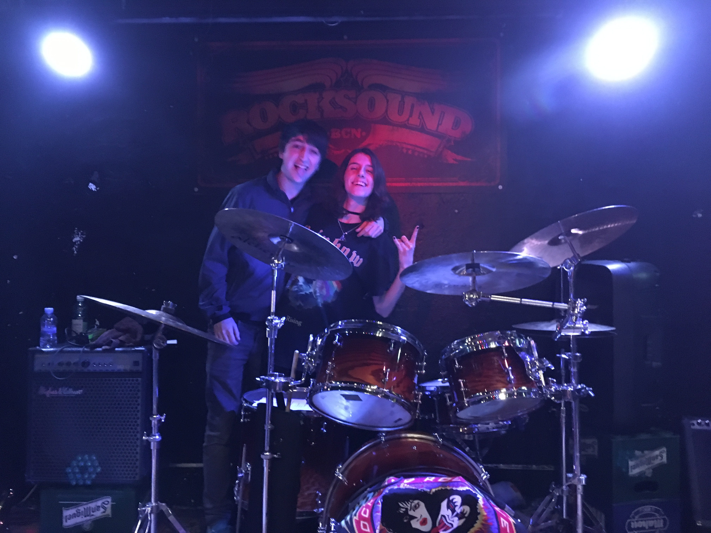

# BYTE

Byte is a management game developed by [Sandra Alvarez](https://github.com/Sandruski) and [Guillem Costa](https://github.com/datBeQuiet) for the AI subject under the supervision of the lecturer <b>Ricard Pillosu</b>. 

In Byte, you take the role of the manager of a burger fast food restaurant (aka diner).
Will you be able to bring the success to your new business or will you throw in the towel? Play with the likes!

> Download the latest release [HERE](https://github.com/WickedNekomata/Byte/releases)

## The team



<i>Alvarez Sandra, code and design:</i>
- [GitHub Account](https://github.com/datBeQuiet)
	
<i>Costa Guillem, code and design:</i>
- [GitHub Account](https://github.com/Sandruski)

## About the game

### Description

The objective of the game is to reach 15 likes without going bankrupt. To achieve it...

- Order meals for the clients.
- Buy different ingredients for the cooks, so they can cook them into meals.
- The waitresses will serve the meals to the clients.
- Buy different types of cookers and buy more cash registers. More cooks and waitresses will come!
- Buy new furniture for the diner (tables and stools). More clients will come!

At the end of the day, the balance of the cash register must be positive. 
Remember that the business has fixed costs (local fix costs and workers' salary)! 
Otherwise, if the balance of the cash register is negative, the business will be forced to close and the game will be over.

### Features

- 3 different types of meals with different effects: hamburguer with chips, nuggets and cake.
- 3 different types of AI agents: clients, waitresses and cooks.
- 4 moods for the clients: happy, neutral, annoyed and angry.
- An extra character for the tutorial.
- 3 different screens: Main Menu, Scene and End Screen.
- Lots of particles and sound effects.

<iframe width="560" height="315" src="https://github.com/WickedNekomata/Byte/blob/master/docs/Like.png" frameborder="0" allow="autoplay; encrypted-media" allowfullscreen></iframe>

### Trailer

### Controls

```
- Up, Down, Left and Right arrows: move the camera
- Move mouse towards the sides of the screen: move the camera
- Click: 
	- On a button: perform an specific action
	- On a client: open their own menu to order food for them
	- On a box: buy a cash register (with a waitress), a cooker (with a cook) or tables and stools.
- F1: restart game
```

### Tools used

- Unity 2018.1.6f1
- NodeCanvas for Unity
- Bitbucket
- Sourcetree

The game uses our <b>own steering behaviours</b> (using [Recast](https://github.com/recastnavigation/recastnavigation) to generate the path) and [Node Canvas](http://nodecanvas.paradoxnotion.com/) for the <b>behaviour trees</b>.
 
### Assets

Models are from Simple Assets, available in the Unity Asset Store. The rest of the assets (UI, music and sounds) are royalty-free.

## License

```
MIT License

Copyright (c) 2018 WickedNekomata (Sandra Alvarez & Guillem Costa)

Permission is hereby granted, free of charge, to any person obtaining a copy
of this software and associated documentation files (the "Software"), to deal
in the Software without restriction, including without limitation the rights
to use, copy, modify, merge, publish, distribute, sublicense, and/or sell
copies of the Software, and to permit persons to whom the Software is
furnished to do so, subject to the following conditions:

The above copyright notice and this permission notice shall be included in all
copies or substantial portions of the Software.

THE SOFTWARE IS PROVIDED "AS IS", WITHOUT WARRANTY OF ANY KIND, EXPRESS OR
IMPLIED, INCLUDING BUT NOT LIMITED TO THE WARRANTIES OF MERCHANTABILITY,
FITNESS FOR A PARTICULAR PURPOSE AND NONINFRINGEMENT. IN NO EVENT SHALL THE
AUTHORS OR COPYRIGHT HOLDERS BE LIABLE FOR ANY CLAIM, DAMAGES OR OTHER
LIABILITY, WHETHER IN AN ACTION OF CONTRACT, TORT OR OTHERWISE, ARISING FROM,
OUT OF OR IN CONNECTION WITH THE SOFTWARE OR THE USE OR OTHER DEALINGS IN THE
SOFTWARE.
```
